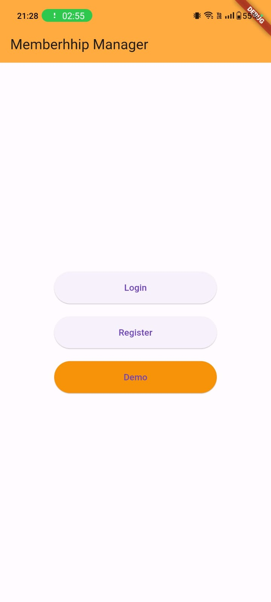
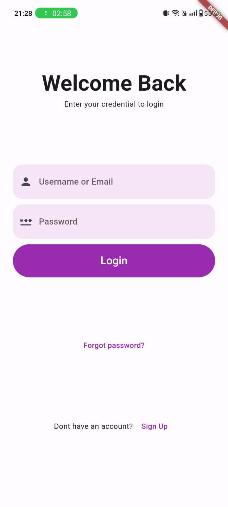
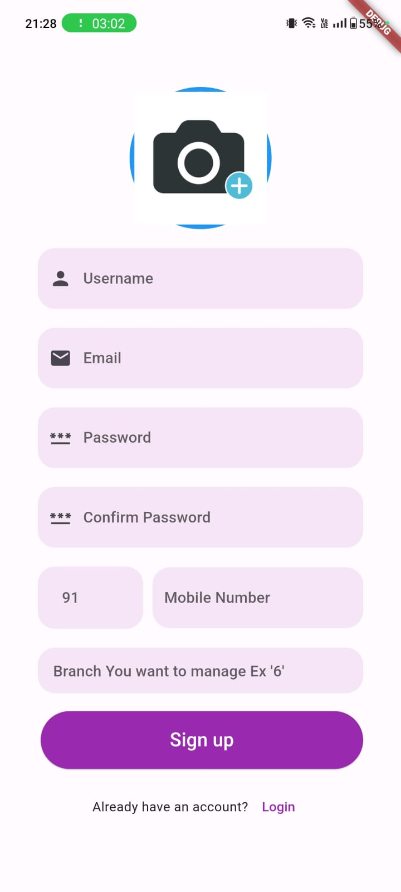
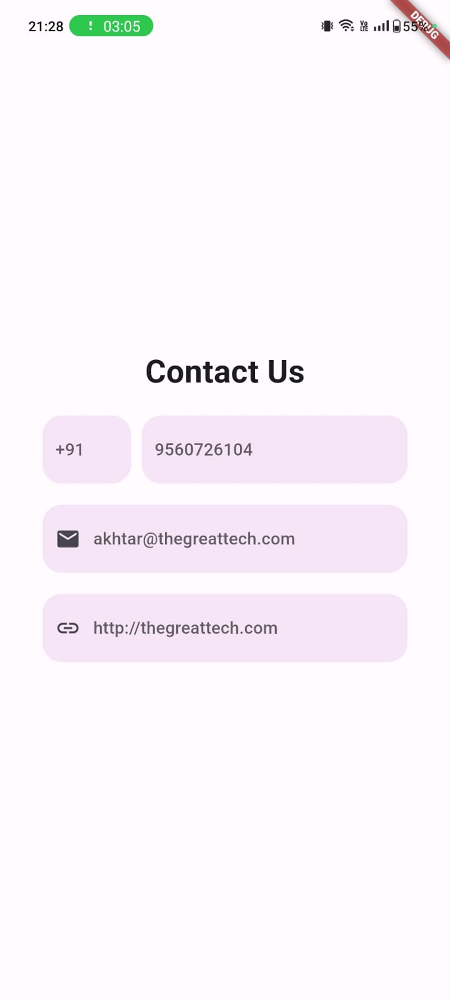
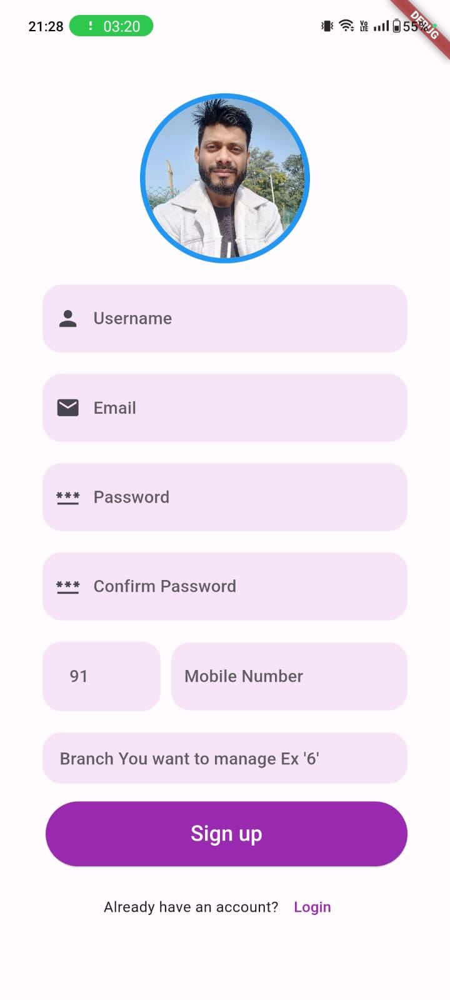
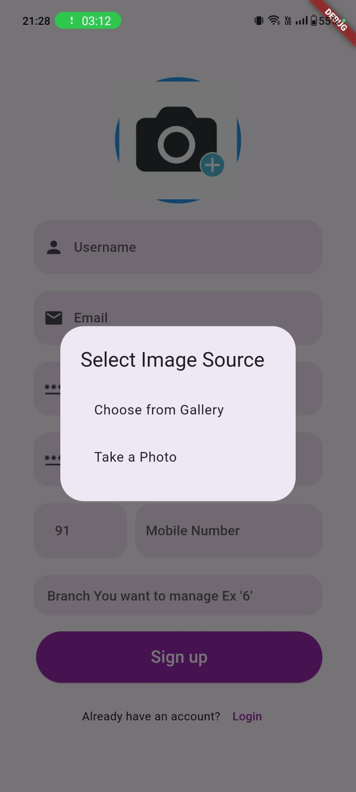

# Membership Management Tool

Welcome to our comprehensive Membership Management Tool, designed to suit various business types and sizes. This tool offers robust features to efficiently handle member data, subscriptions, and engagement. Whether you run a small club, a fitness center, or a large organization, our Membership Management Tool has you covered.

## Features

- **Member Data Management:** Easily manage and organize member information, including personal details, contact information, and membership history.

- **Subscription Management:** Streamline the subscription process with automated tools for sign-ups, renewals, and cancellations. Keep track of payment details and billing cycles effortlessly.

- **Engagement Tools:** Foster member engagement through communication tools, event notifications, and personalized content delivery.

- **Customizable:** Tailor the tool to fit your specific business needs with customizable fields, reports, and dashboards.

- **User-Friendly Interface:** Enjoy a sleek and intuitive interface that makes navigation and data entry a breeze.

## Screenshots

## Screenshots

  
  
  

  
  
  

## Tech Stack

Our Membership Management Tool is built using the following technologies:

### Backend

- **Java:** The primary programming language for building the backend logic.
- **Spring Boot:** A powerful framework for building Java-based enterprise applications.

### Database

- **MySQL:** A robust relational database management system for storing and retrieving member data.

### Frontend

- **Flutter:** For building a cross-platform mobile application with a consistent user experience.

### Communication

- **RESTful API:** Utilizing RESTful principles for communication between the frontend and backend.

### Tools and Libraries

- **Maven:** For project management and dependency resolution.
- **Spring Data JPA:** Simplifies the implementation of data access layers using JPA.
- **Swagger:** For API documentation.
- **MySQL Connector/J:** The official JDBC driver for MySQL.

## Getting Started

To run the Membership Management Tool on your local machine, follow these steps:

1. Clone the repository:

2. Navigate to the project directory:

3. Configure the database connection in the `application.properties` file.

4. Build and run the Spring Boot application:

5. Navigate to the Flutter app directory and run the app:

Now you're ready to explore and use our Membership Management Tool!

For more detailed information, refer to the [official documentation](docs/documentation.md).

## Contributing

We welcome contributions from the community. If you find a bug, have a feature request, or want to contribute in any way, please open an issue or submit a pull request.

Happy managing!
